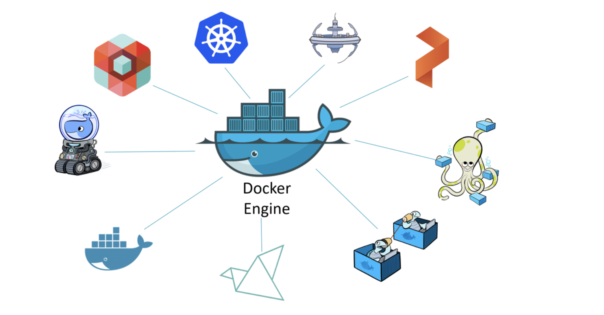

# Docker

## 容器化发展历程
* **远古**：
  * 单一应用独占一个服务器，服务器资源浪费
  * 资本和运营支出的成本高
* **vm**：
  * 多个应用可以共享同一个服务器
  * 允许同一台计算机上同时存在多个操作系统（OS）环境
  * 使用户能够超越硬件限制来实现最终目标
  * vm的OS其消耗的系统资源（cpu、ram、storage）很大，其消耗可以运行多个应用；
  * vm启动慢，迁移难度高并且工作量大
  * [Why use Virtualization](https://docs.oracle.com/cd/E50245_01/E50249/html/vmcon-intro-virt-reasons.html)
  * [Virtual Machine and its Benefits | Parallels Insights](https://www.parallels.com/blogs/ras/virtual-machine/#:~:text=Benefits%20of%20using%20a%20virtual,to%20achieve%20their%20end%20goals.)
* **container**：
  * 同一个主机上的多个container共享单一的os，并且其os是轻量级的
  * 节省了资本和运营支出的成本
  * 可以快速启动、便于迁移
  * 类容器虚拟技术：System/360、BSD Jails 、Solaris Zones（Unix-type container technologies）
* **Docker**（Linux）：
  * 让容器变得更加简单
* **Windows containers**（Docker）
  * 实现windows OS服务器上docker容器化
* **Mac containers** （Docker for mac）
  * 实现macos 运行container， 多用于开发人员测试和开发
* **Kubernetes**
  * Kubernetes is an important piece of software that helps us deploy our containerizedapps and keep them running.

---
参考资料：
* Book: Docker Deep Dive (version 5 -- 2018)
* [Why use Virtualization](https://docs.oracle.com/cd/E50245_01/E50249/html/vmcon-intro-virt-reasons.html)
* [Virtual Machine and its Benefits | Parallels Insights](https://www.parallels.com/blogs/ras/virtual-machine/#:~:text=Benefits%20of%20using%20a%20virtual,to%20achieve%20their%20end%20goals.)

## Docker基础
* **Docker runtime and orchestration engine**
  * Docker Engin：第三方产品插入**Docker Engine**并围绕它进行建造。下图以Docker Engine为中心。图中的其他产品都建立在引擎的基础上，并利用其核心功能。
    
* 

## Docker架构深入理解

## Docker最佳实践