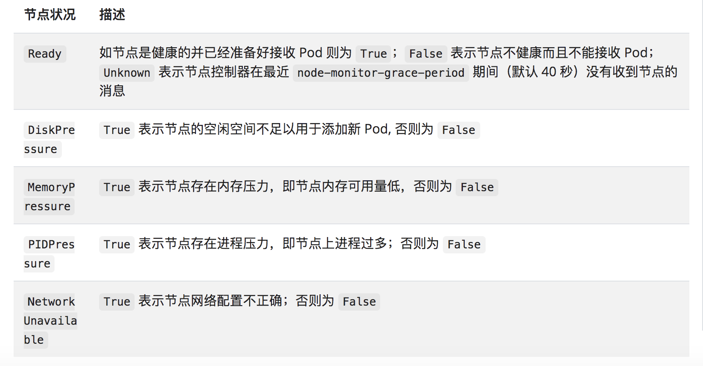

- [1. 背景](#1-背景)
  - [1.1. 容器化](#11-容器化)
  - [1.2. 优势与特点](#12-优势与特点)
- [2. 架构与组件](#2-架构与组件)
  - [2.1. 架构](#21-架构)
    - [2.1.1. Node](#211-node)
      - [2.1.1.1. 管理](#2111-管理)
      - [2.1.1.2. 节点信息](#2112-节点信息)
      - [2.1.1.3. 节点控制器](#2113-节点控制器)
      - [2.1.1.4. 节点容量](#2114-节点容量)
      - [2.1.1.5. 节点拓扑](#2115-节点拓扑)
  - [2.2. api server](#22-api-server)
    - [2.2.1. 基础](#221-基础)
    - [2.2.2. 扩展](#222-扩展)
  - [2.3. etcd](#23-etcd)
  - [2.4. schedule](#24-schedule)
  - [2.5. controller manager](#25-controller-manager)
    - [2.5.1. workload resources](#251-workload-resources)
    - [2.5.2. 节点控制器](#252-节点控制器)
      - [2.5.2.1. 心跳机制](#2521-心跳机制)
      - [2.5.2.2. 可靠性](#2522-可靠性)
    - [2.5.3. 副本控制器](#253-副本控制器)
    - [2.5.4. 端点控制器](#254-端点控制器)
    - [2.5.5. 服务帐户和令牌控制器](#255-服务帐户和令牌控制器)
  - [2.6. cloud-controller-manager](#26-cloud-controller-manager)
  - [2.7. kubelet](#27-kubelet)
  - [2.8. kube-proxy](#28-kube-proxy)
  - [2.9. Container Runtime（如docker）](#29-container-runtime如docker)
  - [2.10. Addons （ 插件 ）](#210-addons--插件-)
- [3. 基本概念](#3-基本概念)
  - [3.1. Kubernetes 对象](#31-kubernetes-对象)
    - [3.1.1. 特点与作用](#311-特点与作用)
    - [3.1.2. Kubernetes 对象管理](#312-kubernetes-对象管理)
    - [3.1.3. 对象名称和 IDs](#313-对象名称和-ids)
    - [3.1.4. Namespaces](#314-namespaces)
    - [3.1.5. Labels and Selectors](#315-labels-and-selectors)
    - [3.1.6. Annotations](#316-annotations)
    - [3.1.7. Field Selectors](#317-field-selectors)
  - [3.2. Pod](#32-pod)
    - [3.2.1. Pod 生命周期](#321-pod-生命周期)
      - [3.2.1.1. 从集群各组件交互角度分析 Pod 生命周期](#3211-从集群各组件交互角度分析-pod-生命周期)
      - [3.2.1.2. Pod 终止过程](#3212-pod-终止过程)
    - [3.2.2. pod 生命周期中的重要行为](#322-pod-生命周期中的重要行为)
    - [3.2.3. CIDR（Pod IP地址规划）](#323-cidrpod-ip地址规划)
- [4. 组件深入分析](#4-组件深入分析)
  - [4.1. schedule](#41-schedule)
    - [4.1.1. schedule 架构与组件](#411-schedule-架构与组件)
    - [4.1.2. 调度流程](#412-调度流程)
    - [4.1.3. 调度算法](#413-调度算法)
- [5. 通信](#5-通信)
  - [5.1. 控制面板（Master） -> 节点（Node）](#51-控制面板master---节点node)
    - [5.1.1. apiserver -> Node](#511-apiserver---node)
    - [5.1.2. SSH 隧道](#512-ssh-隧道)
    - [5.1.3. Konnectivity 服务](#513-konnectivity-服务)
- [6. 网络](#6-网络)
  - [6.1. 虚拟 IP 和 Service 代理](#61-虚拟-ip-和-service-代理)
    - [6.1.1. userspace 代理模式](#611-userspace-代理模式)
    - [6.1.2. iptables 代理模式](#612-iptables-代理模式)
    - [6.1.3. IPVS 代理模式](#613-ipvs-代理模式)
    - [虚拟IP](#虚拟ip)
- [服务发现](#服务发现)
- [7. Deployment](#7-deployment)
  - [7.1. K8S创建Deployment资源流程](#71-k8s创建deployment资源流程)
  - [7.2. Deployment资源属性](#72-deployment资源属性)
- [8. 参考资料](#8-参考资料)
- [9. 问题](#9-问题)


# 1. 背景
> Kubernetes是一个开源的，用于管理云平台中多个主机上的容器化的应用，Kubernetes的目标是让部署容器化的应用简单并且高效（powerful）,Kubernetes提供了应用部署，规划，更新，维护的一种机制。

> Kubernetes is a portable, extensible, open-source platform for managing containerized workloads and services, that facilitates both declarative configuration and automation. It has a large, rapidly growing ecosystem


## 1.1. 容器化
* 容器的优势
  * 可移植性
  * 资源高效性
  * 隔离性
  * 加速开发过程
* 痛点
  * 当微服务构建新的云原生Application或者迁移的时候，构建、部署、扩展难度高
  * 在复杂的多云等生产环境，实现服务发现、负载均衡、存储、故障恢复、回滚、配置管理等，并且结合高度敏捷和高速的CI/CD，难度和复杂度加大
  * **存在困难的编排、管理和调度问题**

## 1.2. 优势与特点
* 功能：
  * 服务发现与负载均衡（ Service discovery and load balancing ）
  * 存储编排（ Storage orchestration ）
  * :question: 自动转出和回滚（Automated rollouts and rollbacks）
  * 自动装箱（ automatic bin packing ）根据节点的CPU和RAM，自动创建容器，充分利用资源
  * 自我恢复（ Self-healing ）自动重启失败容器，替换容器，杀死不响应用户定义健康检查的容器，client 无感知
  * 秘钥和配置管理 （ Secret and Configuration Management ）

* 优势：
  * 快速部署应用
  * 快速扩展应用
  * 无缝对接新的应用功能
  * 节省资源，优化硬件资源的使用

* 特点：
  * 可移植：支持公有云，私有云，混合云，多重云 multi-cloud
  * 可扩展：模块化，插件化，可挂载，可组合
  * 自动化：自动部署，自动重启，自动复制，自动伸缩/扩展

* 缺点：
  


---
# 2. 架构与组件
> K8s 架构就是一个 Master 对应一群 Node 节点


## 2.1. 架构
### 2.1.1. Node
> Kubernetes 通过将容器放入在节点（Node）上运行的 Pod 中来执行你的工作负载。 节点可以是一个虚拟机或者物理机器，取决于所在的集群配置。每个节点都包含用于运行 Pod 所需要的服务，这些服务由 控制面负责管理。
> 
> 节点上的组件包括 kubelet、 容器运行时以及 kube-proxy。

#### 2.1.1.1. 管理
* 添加节点
* 节点自注册
* 节点手动管理

#### 2.1.1.2. 节点信息
* 地址
> 这些字段的用法取决于你的云服务商或者物理机配置。
  * HostName：由节点的内核设置。可以通过 kubelet 的 --hostname-override 参数覆盖。
  * ExternalIP：通常是节点的可外部路由（从集群外可访问）的 IP 地址。
  * InternalIP：通常是节点的仅可在集群内部路由的 IP 地址。

* 状态
> `conditions` 字段描述了所有 Running 节点的状态。状况的示例包括：



conditions 字段描述了所有 Running 节点的状态。状况的示例包括：
* 容量与可分配
> 描述节点上的可用资源：CPU、内存和可以调度到节点上的 Pod 的个数上限。
  * capacity：标示节点拥有的资源总量
  * allocatable：指示节点上可供普通 Pod 消耗的资源量。

* 信息
> 关于节点的一般性信息，例如内核版本、Kubernetes 版本（kubelet 和 kube-proxy 版本）、 Docker 版本（如果使用了）和操作系统名称。这些信息由 kubelet 从节点上搜集而来。

#### 2.1.1.3. 节点控制器
> 同下文

#### 2.1.1.4. 节点容量
>Node 对象会跟踪节点上资源的容量（例如可用内存和 CPU 数量）。 通过自注册机制生成的 Node 对象会在注册期间报告自身容量。 如果你手动添加了 Node，你就需要在添加节点时 手动设置节点容量。

> Kubernetes 调度器保证节点上 有足够的资源供其上的所有 Pod 使用。它会检查节点上所有容器的请求的总和不会超过节点的容量。 总的请求包括由 kubelet 启动的所有容器，但不包括由容器运行时直接启动的容器， 也不包括不受 kubelet 控制的其他进程。

#### 2.1.1.5. 节点拓扑

## 2.2. api server
> apiserver 是 k8s 控制面板的组件之一， 该组件公开了 k8s API，是 k8s 控制面板的前端。（ kube-apiserver 是 k8s api server 的主要实现 ）
> 为了实现 apiserver 的横向扩展，可以实例化多个 apiserver。

### 2.2.1. 基础
* API 服务器负责提供 HTTP API，以供用户、集群中的不同部分和集群外部组件相互通信。
  * 查询和操纵 Kubernetes API 中对象（如：Pod、Namespace、ConfigMap 和 Event）
* 操作 api 的工具和方法
  * rest 
  * kubectl
  * kubeadm

### 2.2.2. 扩展
* Kubernetes 为 API 实现了一种基于 Protobuf 的序列化格式，主要用于集群内部通信。 关于此格式的详细信息，可参考 [Kubernetes Protobuf 序列化](https://github.com/kubernetes/community/blob/master/contributors/design-proposals/api-machinery/protobuf.md) 设计提案。每种模式对应的接口描述语言（IDL）位于定义 API 对象的 Go 包中。


## 2.3. etcd 
> etcd 是兼具一致性和高可用性的键值数据库，可以作为保存 Kubernetes 所有集群数据的后台数据库。


## 2.4. schedule
> sechedule 可以监控最新创建而且没有被分配节点的 pod，并且调度合适的节点运行 pod

* 影响调度的因素：
  * 个体和集体的资源需求
  * 硬件/软件/策略约束
  * 亲和性和非亲和性规范
  * 数据本地化
  * 内部工作负载的干扰
  * 期限

## 2.5. controller manager
> 在主节点上运行 控制器 的组件
> 从逻辑上讲，每个控制器都是一个单独的进程， 但是为了降低复杂性，它们都被编译到同一个可执行文件，并在一个进程中运行。

* 控制器类型:
  * **节点控制器**（Node Controller）: 负责在节点出现故障时进行通知和响应。
  * **副本控制器**（Replication Controller）: 负责为系统中的每个副本控制器对象维护正确数量的 Pod。
  * :question: **端点控制器**（Endpoints Controller）: 填充端点(Endpoints)对象(即加入 Service 与 Pod)。
  * **服务帐户和令牌控制器**（Service Account & Token Controllers）: 为新的命名空间创建默认帐户和 API 访问令牌.

### 2.5.1. workload resources
* Deployment 和 ReplicaSet （替换原来的资源 ReplicationController）。 Deployment 很适合用来管理你的集群上的无状态应用，Deployment 中的所有 Pod 都是相互等价的，并且在需要的时候被换掉。
* StatefulSet 让你能够运行一个或者多个以某种方式跟踪应用状态的 Pods。 例如，如果你的负载会将数据作持久存储，你可以运行一个 StatefulSet，将每个 Pod 与某个 PersistentVolume 对应起来。你在 StatefulSet 中各个 Pod 内运行的代码可以将数据复制到同一 StatefulSet 中的其它 Pod 中以提高整体的服务可靠性。
* DaemonSet 定义提供节点本地支撑设施的 Pods。这些 Pods 可能对于你的集群的运维是 非常重要的，例如作为网络链接的辅助工具或者作为网络 插件 的一部分等等。每次你向集群中添加一个新节点时，如果该节点与某 DaemonSet 的规约匹配，则控制面会为该 DaemonSet 调度一个 Pod 到该新节点上运行。
* Job 和 CronJob。 定义一些一直运行到结束并停止的任务。Job 用来表达的是一次性的任务，而 CronJob 会根据其时间规划反复运行。

### 2.5.2. 节点控制器
**节点控制器在节点的生命周期中扮演的角色：**
* 当节点注册时并且启用了 CIDR 分配，为它分配一个 CIDR（Pod IP地址规划）区段。
* 保持节点控制器内的节点列表与云服务商所提供的可用机器列表同步。
  *  如果在云环境下运行，只要某节点不健康，节点控制器就会询问云服务是否节点的虚拟机仍可用。 
  *  如果不可用，节点控制器会将该节点从它的节点列表删除。
* 监控节点的健康情况。
  * 节点控制器负责在节点不可达 （即，节点控制器因为某些原因没有收到心跳，例如节点宕机）时， 将节点状态的 NodeReady 状况更新为 "Unknown"。
  * 如果节点接下来持续处于不可达状态，节点控制器将逐出节点上的所有 Pod（使用体面终止）。
  * 默认情况下 40 秒后开始报告 "Unknown"，在那之后 5 分钟开始逐出 Pod。 节点控制器每隔 --node-monitor-period 秒检查每个节点的状态。

#### 2.5.2.1. 心跳机制
> Kubernetes 节点发送的心跳（Heartbeats）有助于确定节点的可用性。
心跳有两种形式:
*  NodeStatus 
*  the Lease object
   *  Lease 是一种轻量级的资源，可在集群规模扩大时提高节点心跳机制的性能

**kubelet 负责创建和更新 NodeStatus 和 Lease 对象**
*  NodeStatus 
  * 当状态发生变化时，或者在配置的时间间隔内没有更新事件时，kubelet 会更新 NodeStatus。 
  * NodeStatus 更新的默认间隔为 5 分钟（比不可达节点的 40 秒默认超时时间长很多）。
* Lease object
  * kubelet 会每 10 秒（默认更新间隔时间）创建并更新其 Lease 对象。 
  * Lease 更新独立于 NodeStatus 更新而发生。 
  * 如果 Lease 的更新操作失败，kubelet 会采用指数回退机制，从 200 毫秒开始 重试，最长重试间隔为 7 秒钟。

#### 2.5.2.2. 可靠性

### 2.5.3. 副本控制器

### 2.5.4. 端点控制器

### 2.5.5. 服务帐户和令牌控制器


## 2.6. cloud-controller-manager
> 云控制器管理器是指嵌入特定云的控制逻辑的 控制平面组件。 云控制器管理器允许您链接聚合到云提供商的应用编程接口中， 并分离出相互作用的组件与您的集群交互的组件。
> 
> `cloud-controller-manager` 仅运行特定于云平台的控制回路。 如果你在自己的环境中运行 Kubernetes，或者在本地计算机中运行学习环境， 所部署的环境中不需要云控制器管理器。

* 包含对云平台驱动的依赖的控制器:
  * **节点控制器**（Node Controller）: 用于在节点终止响应后检查云提供商以确定节点是否已被删除
  * **路由控制器**（Route Controller）: 用于在底层云基础架构中设置路由
  * **服务控制器**（Service Controller）: 用于创建、更新和删除云提供商负载均衡器


## 2.7. kubelet
> kubelet 是在集群中的每个节点上运行的代理，它保证容器（containers）都运行在 Pod 中。

## 2.8. kube-proxy
> kube-proxy 是集群中每个节点上运行的网络代理， 实现 Kubernetes 服务（Service） 概念的一部分。
>
> kube-proxy 维护节点上的网络规则。这些网络规则允许从集群内部或外部的网络会话与 Pod 进行网络通信。

:question:*如果操作系统提供了数据包过滤层并可用的话，kube-proxy 会通过它来实现网络规则。否则， kube-proxy 仅转发流量本身*

## 2.9. Container Runtime（如docker）
> 容器运行环境是负责运行容器的软件
> 
> Kubernetes 支持多个容器运行环境: Docker、 containerd、CRI-O 以及任何实现 Kubernetes CRI (容器运行环境接口)。

## 2.10. Addons （ 插件 ）
> Addons 使用 Kubernetes 资源（DaemonSet、 Deployment等）实现集群功能。 因为这些插件提供集群级别的功能，插件中命名空间域的资源属于 kube-system 命名空间。 ( k8s 可扩展性 )

常用插件：
* DNS 
* Web UI (Dashboard) 
* Container Resource Monitoring
* Cluster-level Logging

---
# 3. 基本概念
## 3.1. Kubernetes 对象
> 在 Kubernetes 系统中，Kubernetes 对象 是持久化的实体。 Kubernetes 使用这些实体去表示整个集群的状态。特别地，它们描述了如下信息：
* 正在运行的容器化应用（以及运行的节点）
* 容器应用的可用资源
* 应用运行时的策略，比如重启策略、升级策略，以及容错策略

### 3.1.1. 特点与作用
* Kubernetes 对象是 **目标性记录**， 一旦创建对象，Kubernetes 系统将持续工作以确保对象存在 
* 通过创建对象，告知 Kubernetes 系统，所需要的集群工作负载看起来是什么样子的， 这就是 Kubernetes 集群的 期望状态（ Desired State ）


### 3.1.2. Kubernetes 对象管理
通过 kubernetes api 对对象进行操作，如 kubectl、程序中使用客户端库直接调

* 每个 Kubernetes 对象包含两个嵌套的对象字段：spec、status
  * spec ：你必须在创建对象时设置其内容，描述你希望对象所具有的特征： 期望状态（Desired State） 
  * status： 描述了对象的 当前状态（Current State），它是由 Kubernetes 系统和组件 设置并更新的
* [管理对象的方式](https://kubernetes.io/docs/concepts/overview/working-with-objects/object-management/)
  * 命令行 （ kubectl ）
  * 命令对象配置，配置定义在 yaml 或 json 文件中 （配合kubectl）
  * 声明对象配置, 配置可以在目录上工作，根据目录中配置文件对不同的对象执行不同的操作

### 3.1.3. [对象名称和 IDs](https://kubernetes.io/docs/concepts/overview/working-with-objects/names/)
> 集群中的每一个对象都有一个 `名称` 来标识在同类资源中的唯一性。
> 每个 Kubernetes 对象也有一个 `UID` 来标识在整个集群中的唯一性。


### 3.1.4. [Namespaces](https://kubernetes.io/docs/concepts/overview/working-with-objects/namespaces/)
> Kubernetes 支持多个虚拟集群，它们底层依赖于同一个物理集群。 这些虚拟集群被称为名字空间。

### 3.1.5. [Labels and Selectors](https://kubernetes.io/docs/concepts/overview/working-with-objects/labels/)
> 标签用于快速查询 k8s 对象或组，selector用于筛选标签的匹配符
```YAML
"metadata": {
  "labels": {
    "key1" : "value1",
    "key2" : "value2"
  }
}
```


### 3.1.6. [Annotations](https://kubernetes.io/docs/concepts/overview/working-with-objects/annotations/)
> 你可以使用 Kubernetes 注解为对象附加任意的非标识的元数据。客户端程序（例如工具和库）能够获取这些元数据信息。

```YAML
"metadata": {
  "annotations": {
    "key1" : "value1",
    "key2" : "value2"
  }
}
```

**使用注解来记录**:
* 由声明性配置所管理的字段。 将这些字段附加为注解，能够将它们与客户端或服务端设置的默认值、 自动生成的字段以及通过自动调整大小或自动伸缩系统设置的字段区分开来。
* 构建、发布或镜像信息（如时间戳、发布 ID、Git 分支、PR 数量、镜像哈希、仓库地址）。
* 指向日志记录、监控、分析或审计仓库的指针。
* 可用于调试目的的客户端库或工具信息：例如，名称、版本和构建信息。
* 用户或者工具/系统的来源信息，例如来自其他生态系统组件的相关对象的 URL。
* 轻量级上线工具的元数据信息：例如，配置或检查点。
* 负责人员的电话或呼机号码，或指定在何处可以找到该信息的目录条目，如团队网站。
* 从用户到最终运行的指令，以修改行为或使用非标准功能。

你可以将这类信息存储在外部数据库或目录中而不使用注解， 但这样做就使得开发人员很难生成用于部署、管理、自检的客户端共享库和工具。

### 3.1.7. [Field Selectors](https://kubernetes.io/docs/concepts/overview/working-with-objects/field-selectors/)
> 字段选择器（Field selectors）允许你根据一个或多个资源字段的值 筛选 Kubernetes 资源。 下面是一些使用字段选择器查询的例子：

* metadata.name=my-service
* metadata.namespace!=default
* status.phase=Pending

下面这个 kubectl 命令将筛选出 status.phase 字段值为 Running 的所有 Pod：
```BASH
kubectl get pods --field-selector status.phase=Running
```

## 3.2. Pod
> Pod 是 kubernetes 系统的基础单元，是由用户创建或部署的最小组件，也是 kubernetes 系统上运行容器化应用的资源对象。
> 一个 Pod (如 docker ) 是一个或多个容器组成的，具有共享的存储和网络资源，以及如何运行这些容器的规范。
### 3.2.1. Pod 生命周期
* pending 
* running
* succeeded
* failed
* Unknown

#### 3.2.1.1. 从集群各组件交互角度分析 Pod 生命周期


* API Server
> API Server 提供了集群与外部交互的接口，可以通过 kubectl 命令或者其他 API 客户端提交 pod spec 来创建Pod。流程如下：
1. API Server 接收到创建pod的请求，根据请求参数创建运行时的Pod对象。
2. 系统根据 API Server 请求的上下文的元数据来验证两者的 namespace 是否匹配，如果不匹配则创建失败。
3. Namespace 匹配成功后，向 pod 对象注入系统数据。（如果未提供 pod 的名字，则 API Server 会将 pod 的 uid 作为 pod 的名字）。
4. API Server 接下来会检查 pod 对象的必需字段是否为空，如果为空，创建失败。
5. 上述准备工作完成之后会将在 etcd 中持久化这个对象，将异步调用返回结果封装成 restful.response，完成结果反馈。
6. 至此，API Server 创建过程完成，剩下的由 scheduler 和 kubelet 来完成，此时 **pod 处于 pending 状态**。

* Scheduler
>   创建 pod 的请求与 API Server 的交互完成之后，接下来由 scheduler 进行工作，该组件主要是完成 pod 的调度来决定 pod 具体运行在集群的哪个节点上。
>   API Server 完成任务之后，将信息写入到 etcd 中，此时 **scheduler 通过 watch 机制监听到写入到 etcd 的Pod信息然后再进行工作**。
>   Scheduler 读取到写入到 etcd 中的 pod 信息，然后基于一系列规则从集群中挑选一个合适的节点来运行它，调度时主要通过三步来确定 pod 运行节点：

1. **节点预选**：基于一系列预选规则（如 PodFitsResource 和 MatchNode-Selector 等）对每个节点进行检查，将不符合的节点过滤掉从而完成节点预选。
2. **节点优选**：对预选出的节点进行优先级排序，以便选出最适合运行 pod 对象的节点。
3. **运行节点**：从优先级结果中挑选出优先级最高的节点来运行 pod 对象，当此类节点多个时则随机选择一个。

> 注：如果有**特殊 pod 资源需要运行在特殊节点**上，此时可以通过**组合节点标签以及 pod 标签和标签选择器**等来实现高级调度，如 MatchInterPodAffinity、MatchNodeSelector 和 PodToleratesNodeTaints 等预选策略，他们为用户提供自定义 Pod 亲和性或反亲和性、节点亲和性以及基于污点及容忍度的调度机制。

* kubelet
> kubelet 组件启动 pod，需要创建节点、节点管理、cAdvisor 资源监控管理、容器健康检查等功能

> kubelet 通过 API Server 监听 etcd 目录，同步 pod 列表。发现信息有变化，根据列表信息对pod进行创建于更新。具体流程如下：
1. 创建pod数据目录
2. 从 API Server 读取Pod清单
3. 挂载Pod外部卷
4. 下载对应 pod 的 secret
5. 检查运行在该节点的 pod， 如果该 pod 没有容器或者 pause 容器没有启动，先暂停 pod 的所有容器进程
6. 使用 pause 镜像为每个 pod 创建一个容器，该容器作用是用来接管 pod 中 其他所有容器的网络
7. 为 pod 每个容器做如下处理：
   1. 为容器计算一个 hash 值，然后用容器的名字去查询对于 docker 容器的 hash 值。
   2. 若查找到容器且两者的 hash 值不同，则停止 docker 中容器中进程，并停止与之关联的 pause 容器，若相同，则不做处理。
   3. 若容器被终止了，且容器没有指定的重启策略，则不做任何处理。
   4. 调用 docker client 下载容器镜像，并启动容器。


#### 3.2.1.2. Pod 终止过程
1. 用户发出删除 pod 命令
2. Pod 对象随着时间的推移更新，在宽限期（默认情况下30秒），pod 被视为 `dead` 状态
3. 将 pod 标记为 `Terminating` 状态
4. 第三步同时运行，监控到 pod 对象为 `Terminating` 状态的同时启动 pod 关闭过程
5. 第三步同时进行，endpoints 控制器监控到 pod 对象关闭，将pod与service匹配的 endpoints 列表中删除
6. 如果 pod 中定义了 preStop 钩子处理程序，则 pod 被标记为 `Terminating` 状态时以同步的方式启动执行；若宽限期结束后，preStop 仍未执行结束，第二步会重新执行并额外获得一个2秒的小宽限期
7. Pod 内对象的容器收到 TERM 信号
8. 宽限期结束之后，若存在任何一个运行的进程，pod 会收到 SIGKILL 信号
9. Kubelet 请求 API Server 将此 Pod 资源宽限期设置为0从而完成删除操作

### 3.2.2. pod 生命周期中的重要行为
* 初始化容器
* 声明周期钩子函数
* 容器探测

### 3.2.3. CIDR（Pod IP地址规划）
[k8s Pod IP地址规划--CIDR](https://zhuanlan.zhihu.com/p/87792675)


# 4. 组件深入分析

## 4.1. schedule 
### 4.1.1. schedule 架构与组件

### 4.1.2. 调度流程

### 4.1.3. 调度算法


# 5. 通信
## 5.1. 控制面板（Master） -> 节点（Node）
> 从控制面（apiserver）到节点有两种主要的通信路径
### 5.1.1. apiserver -> Node
* `apiserver` 到集群中每个节点上运行的 `kubelet` 
  * 获取 Pod 日志
  * 挂接（通过 kubectl）到运行中的 Pod
  * 提供 kubelet 的端口转发功能。
  * 注意：默认情况下，apiserver 不检查 kubelet 的服务证书
* apiserver 通过它的代理功能连接到任何节点、Pod 或者服务
  * 从 apiserver 到节点、Pod 或服务的连接默认为纯 HTTP 方式
  * 可通过给 API URL 中的节点、Pod 或服务名称添加前缀 https: 来运行在安全的 HTTPS 连接上

### 5.1.2. SSH 隧道
> Kubernetes 支持使用 SSH 隧道来保护从控制面到节点的通信路径。在这种配置下，apiserver 建立一个到集群中各节点的 SSH 隧道（连接到在 22 端口监听的 SSH 服务） 并通过这个隧道传输所有到 kubelet、节点、Pod 或服务的请求。 这一隧道保证通信不会被暴露到集群节点所运行的网络之外。
> 
> SSH 隧道目前已被废弃。除非你了解个中细节，否则不应使用。 Konnectivity 服务是对此通信通道的替代品。

### 5.1.3. Konnectivity 服务
> 作为 SSH 隧道的替代方案，Konnectivity 服务提供 TCP 层的代理，以便支持从控制面到集群的通信。 

> Konnectivity 服务包含两个部分：
* Konnectivity 服务器和 Konnectivity 代理，分别运行在 控制面网络和节点网络中。
* Konnectivity 代理建立并维持到 Konnectivity 服务器的网络连接。 启用 Konnectivity 服务之后，所有控制面到节点的通信都通过这些连接传输


# 6. 网络
Kubernetes 网络解决四方面的问题：
* 一个 Pod 中的容器之间通过本地回路（loopback）通信。
* 集群网络在不同 pod 之间提供通信。
* Service 资源允许你对外暴露 Pods 中运行的应用程序，以支持来自于集群外部的访问。
* 可以使用 Services 来发布仅供集群内部使用的服务。

## 6.1. 虚拟 IP 和 Service 代理

### 6.1.1. userspace 代理模式


### 6.1.2. iptables 代理模式


### 6.1.3. IPVS 代理模式


### 虚拟IP
> Kubernetes集群里有三种IP地址，分别如下：
* Node IP：Node节点的IP地址，即物理网卡的IP地址。
* Pod IP：Pod的IP地址，即docker容器的IP地址，此为虚拟IP地址。
* Cluster IP：Service的IP地址，此为虚拟IP地址。


# 服务发现

> Kubernetes 支持两种基本的服务发现模式 —— 环境变量和 DNS。

* 环境变量

* DNS
# 7. Deployment
> Deployment是一个定义及管理多副本应用（即多个副本 Pod）的新一代对象，与Replication Controller相比，它提供了更加完善的功能，使用起来更加简单方便。

## 7.1. K8S创建Deployment资源流程
* 用户通过 kubectl 创建 Deployment。
* *Deployment 创建 ReplicaSet。
* *ReplicaSet 创建 Pod。

## 7.2. Deployment资源属性
* apiVersion
> 注意这里apiVersion对应的值是apps/v1
> 
> 这个版本号需要根据安装的Kubernetes版本和资源类型进行变化，记住不是写死的。此值必须在kubectl apiversion中
* kind：资源类型， 这里指定为Deployment
* 

**参考资料**
[Deployment资源详解](https://zhuanlan.zhihu.com/p/126292353)
[怎么写 k8s 容器编排控制器 Deployment?](https://zhuanlan.zhihu.com/p/203679568)
# 8. 参考资料
* [Kubernetes 文档](https://kubernetes.io/docs/home/)
* [Kubernetes 中文文档](https://kubernetes.io/zh/docs/home/)


# 9. 问题
* namespace 的作用？使用中注意事项？


* schedule 基础的调度策略，如何执行的？


* 为什么还要选用 etcd, 作为 k8s 的数据库？


* 不同 controller manager 具体 工作流程 和 区别？优缺点？
* controller manager 中的 端点控制器 是什么？工作流程？优缺点？
* cloud controller manager 有哪些类型，工作流程和作用？优缺点？


* k8s 为什么设计 Addons ？分析意图和优缺点。

*  Kubernetes Protobuf 序列化设计规范，有什么优缺点？