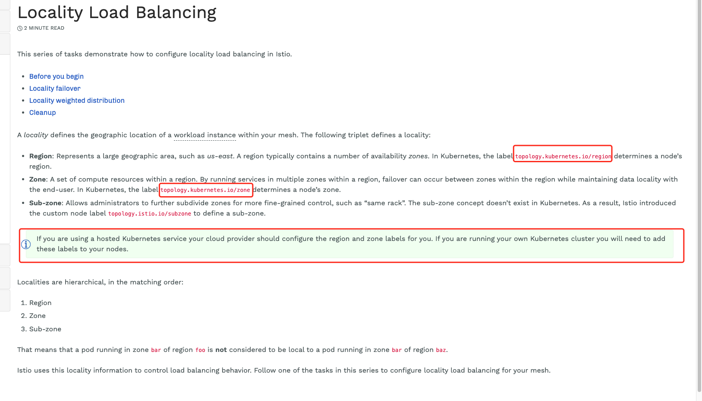

- [负载均衡集群实践](#负载均衡集群实践)
  - [创建集群](#创建集群)
  - [在多集群中安装 Istio](#在多集群中安装-istio)
    - [安装 istioctl 并且配置环境变量](#安装-istioctl-并且配置环境变量)
    - [安装 istio](#安装-istio)
    - [启动端点发现](#启动端点发现)
  - [配置 region、zone 标签，用于 集群分区](#配置-regionzone-标签用于-集群分区)
    - [添加 label](#添加-label)
    - [配置分区环境变量，创建上下文的命名空间](#配置分区环境变量创建上下文的命名空间)
  - [部署测试示例](#部署测试示例)
  - [Locality weighted distribution（负载均衡权重）](#locality-weighted-distribution负载均衡权重)

## 负载均衡集群实践
### 创建集群
* cluster1 1个主节点，1个工作节点
* cluster2 1个主节点，2个工作节点

```bash
# create cluster1
cat <<EOF >  cluster1.yaml
kind: Cluster
apiVersion: kind.x-k8s.io/v1alpha4
nodes:
- role: control-plane
- role: worker
EOF
kind create cluster --config cluster1.yaml --name cluster1

# create cluster2
cat <<EOF >  cluster2.yaml
kind: Cluster
apiVersion: kind.x-k8s.io/v1alpha4
nodes:
- role: control-plane
- role: worker
- role: worker
EOF
kind create cluster --config cluster2.yaml --name cluster2

# check cluster config
kubectl config get-contexts

# switch cluster
kubectl config use-context kind-cluster1
kubectl config use-context kind-cluster2
```

### 在多集群中安装 Istio
#### 安装 istioctl 并且配置环境变量

```bash
# export cluster context
export CTX_CLUSTER1=kind-cluster1
export CTX_CLUSTER2=kind-cluster2

# install istio
curl -L https://istio.io/downloadIstio | sh -
# note： replace version
export PATH="$PATH:/root/istio-1.9.1/bin"
istioctl x precheck
```

#### 安装 istio
```bash
# apply config to cluster1
cat <<EOF > istio-cluster1.yaml
apiVersion: install.istio.io/v1alpha1
kind: IstioOperator
spec:
  values:
    global:
      meshID: mesh1
      multiCluster:
        clusterName: cluster1
      network: network1
EOF
istioctl install --context="${CTX_CLUSTER1}" -f istio-cluster1.yaml

# apply config to cluster2
cat <<EOF > istio-cluster2.yaml
apiVersion: install.istio.io/v1alpha1
kind: IstioOperator
spec:
  values:
    global:
      meshID: mesh1
      multiCluster:
        clusterName: cluster2
      network: network1
EOF
istioctl install --context="${CTX_CLUSTER2}" -f istio-cluster2.yaml
```

#### 启动端点发现
集群之间相互配置访问权限
```bash
istioctl x create-remote-secret \
    --context="${CTX_CLUSTER1}" \
    --name=cluster1 | \
    kubectl apply -f - --context="${CTX_CLUSTER2}"

istioctl x create-remote-secret \
    --context="${CTX_CLUSTER2}" \
    --name=cluster2 | \
    kubectl apply -f - --context="${CTX_CLUSTER1}"

```

### 配置 region、zone 标签，用于 集群分区

#### 添加 label
这里只是根据[官方要求](https://istio.io/latest/docs/tasks/traffic-management/locality-load-balancing/)进行推测配置


```bash
# cluster 1
kubectl config use-context kind-cluster1
kubectl label nodes cluster1-control-plane topology.kubernetes.io/region=region1
kubectl label nodes cluster1-worker topology.kubernetes.io/region=region1
kubectl label nodes cluster1-control-plane topology.kubernetes.io/zone=zone1
kubectl label nodes cluster1-worker topology.kubernetes.io/zone=zone2

# confirm label
kubectl label --list nodes cluster1-control-plane | grep topology.kubernetes.io/
kubectl label --list nodes cluster1-worker | grep topology.kubernetes.io/


# cluster 2
kubectl config use-context kind-cluster2
kubectl label nodes cluster2-control-plane topology.kubernetes.io/region=region2
kubectl label nodes cluster2-worker topology.kubernetes.io/region=region3
kubectl label nodes cluster2-control-plane topology.kubernetes.io/zone=zone3
kubectl label nodes cluster2-worker topology.kubernetes.io/zone=zone4

# confirm label
kubectl label --list nodes cluster2-control-plane | grep topology.kubernetes.io/
kubectl label --list nodes cluster2-worker | grep topology.kubernetes.io/


# note: if add error label, you can delete label
kubectl label --overwrite nodes cluster2-worker2 topology.kubernetes.io/zone-
```

#### 配置分区环境变量，创建上下文的命名空间
```bash
# set env
export CTX_PRIMARY=kind-cluster1
export CTX_R1_Z1=region1.zone1
export CTX_R1_Z2=region1.zone2
export CTX_R2_Z3=region2.zone3
export CTX_R3_Z4=region3.zone4
```
**创建分区相关的 上下文**
对这部分的理解大致上是，对对分区进行操作隔离
```bash
mkdir istio-lb
cd istio-lb/

cat <<EOF > istio-lb-context.yaml
apiVersion: v1
kind: Config
preferences: {}

contexts:
- context:
  name: region1.zone1
- context:
  name: region1.zone2
- context:
  name: region2.zone3
- context:
  name: region3.zone4
EOF
# set context
kubectl config set-context region1.zone1 --cluster=kind-cluster1 --user=kind-cluster1
kubectl config set-context region1.zone2 --cluster=kind-cluster1 --user=kind-cluster1
kubectl config set-context region2.zone3 --cluster=kind-cluster2 --user=kind-cluster2
kubectl config set-context region3.zone4 --cluster=kind-cluster2 --user=kind-cluster2
# view context
kubectl config view

cat <<EOF > sample.yaml
apiVersion: v1
kind: Namespace
metadata:
  name: sample
  labels:
    istio-injection: enabled
EOF
```
这里按照官方进行对不同上下文，应用命名空间。

疑问: 上下文可以共用一个 cluster 的时候，命名空间应该是唯一的，下面操作存在无意义行为

```bash
kubectl config use-context kind-cluster1
for CTX in "$CTX_PRIMARY" "$CTX_R1_Z1" "$CTX_R1_Z2"; \
  do \
    kubectl --context="$CTX" apply -f sample.yaml; \
  done

kubectl config use-context kind-cluster2
for CTX in "$CTX_R2_Z3" "$CTX_R3_Z4"; \
  do \
    kubectl --context="$CTX" apply -f sample.yaml; \
  done
```

### 部署测试示例
下面全部参考[官方负载均衡案例：Before you begin](https://istio.io/latest/docs/tasks/traffic-management/locality-load-balancing/before-you-begin/)
```bash
# Deploy HelloWorld
# Generate the HelloWorld YAML for each locality, using the locality as the version string:
for LOC in "region1.zone1" "region1.zone2" "region2.zone3" "region3.zone4"; \
  do \
    sh samples/helloworld/gen-helloworld.sh \
      --version "$LOC" > "helloworld-${LOC}.yaml"; \
  done

# Apply the HelloWorld YAML to the appropriate cluster for each locality:
kubectl config use-context kind-cluster1
kubectl apply --context="${CTX_R1_Z1}" -n sample \
  -f helloworld-region1.zone1.yaml

kubectl apply --context="${CTX_R1_Z2}" -n sample \
  -f helloworld-region1.zone2.yaml

kubectl config use-context kind-cluster2
kubectl apply --context="${CTX_R2_Z3}" -n sample \
  -f helloworld-region2.zone3.yaml

kubectl apply --context="${CTX_R3_Z4}" -n sample \
  -f helloworld-region3.zone4.yaml


# Deploy Sleep
# Deploy the Sleep application to region1 zone1:
kubectl config use-context kind-cluster1
kubectl apply --context="${CTX_R1_Z1}" \
  -f samples/sleep/sleep.yaml -n sample

# Wait for HelloWorld pods
kubectl get pod --context="${CTX_R1_Z1}" -n sample -l app="helloworld" \
  -l version="region1.zone1" -owide
kubectl get pod --context="${CTX_R1_Z2}" -n sample -l app="helloworld" \
  -l version="region1.zone2" -owide
kubectl get pod --context="${CTX_R2_Z3}" -n sample -l app="helloworld" \
  -l version="region2.zone3" -owide
kubectl get pod --context="${CTX_R3_Z4}" -n sample -l app="helloworld" \
  -l version="region3.zone4" -owide

```

### Locality weighted distribution（负载均衡权重）
参考[官方案例：Locality weighted distribution](https://istio.io/latest/docs/tasks/traffic-management/locality-load-balancing/distribute/)
```bash
# 配置目标权重
kubectl --context="${CTX_PRIMARY}" apply -n sample -f - <<EOF
apiVersion: networking.istio.io/v1beta1
kind: DestinationRule
metadata:
  name: helloworld
spec:
  host: helloworld.sample.svc.cluster.local
  trafficPolicy:
    loadBalancer:
      localityLbSetting:
        enabled: true
        distribute:
        - from: region1/zone1/*
          to:
            "region1/zone1/*": 70
            "region1/zone2/*": 20
            "region3/zone4/*": 10
    outlierDetection:
      consecutive5xxErrors: 100
      interval: 1s
      baseEjectionTime: 1m
EOF

# Verify the distribution
# Call the HelloWorld service from the Sleep pod:
kubectl exec --context="${CTX_R1_Z1}" -n sample -c sleep \
  "$(kubectl get pod --context="${CTX_R1_Z1}" -n sample -l \
  app=sleep -o jsonpath='{.items[0].metadata.name}')" \
  -- curl -sSL helloworld.sample:5000/hello
```

问题：负载均衡只实现了 `region1.zone1` 和 `region1.zone2` 的流量控制，都是 `cluster1`。`cluster2` 的 `region3.zone4` 没有被调用
