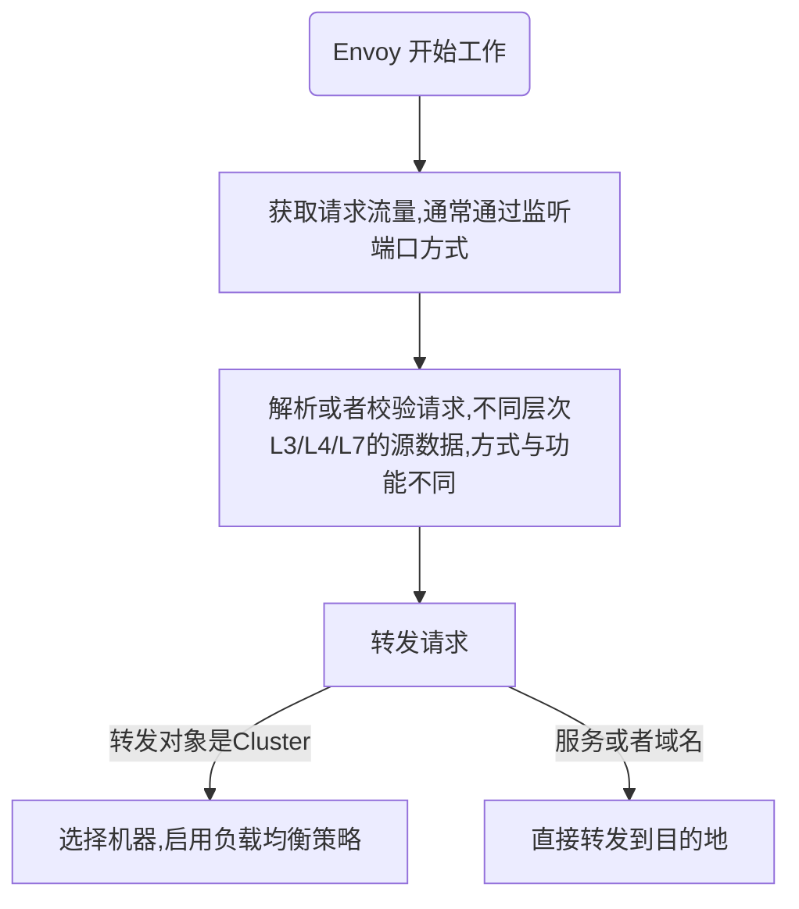

# Envoy

- [Envoy](#envoy)
  - [基本介绍](#基本介绍)
  - [Envoy 原理](#envoy-原理)
    - [基本流程](#基本流程)
    - [基本角色与术语](#基本角色与术语)
    - [Envoy 架构](#envoy-架构)
    - [Envoy 配置结构](#envoy-配置结构)
    - [过滤器（Filter）](#过滤器filter)
  - [Envoy 使用](#envoy-使用)
    - [Listener](#listener)
    - [filter](#filter)
    - [cluster](#cluster)
    - [日志](#日志)
    - [高级功能](#高级功能)
      - [链路追踪](#链路追踪)
      - [指标统计](#指标统计)
  - [Envoy Deep live](#envoy-deep-live)
    - [Envoy 线程模型](#envoy-线程模型)
      - [原理与架构](#原理与架构)
        - [线程类型](#线程类型)
        - [连接处理](#连接处理)
        - [非阻塞](#非阻塞)
        - [TLS Cluster 管理流程](#tls-cluster-管理流程)
        - [其他使用 TLS 的子系统](#其他使用-tls-的子系统)
        - [已知的性能缺陷](#已知的性能缺陷)
  - [参考文档](#参考文档)

## 基本介绍

Envoy 是专为大型现代 SOA（面向服务架构）架构设计的 L7 代理和通信总线，体积小，性能高。它的诞生源于以下理念：

> 对应用程序而言，网络应该是透明的。当网络和应用程序出现故障时，应该能够很容易确定问题的根源。

详细信息可以参考[官方文档](https://www.envoyproxy.io/docs/envoy/latest/start/start)
[中文文档](https://fuckcloudnative.io/envoy-handbook/docs/gettingstarted/quick-start/)

## Envoy 原理

### 基本流程



### 基本角色与术语

listener : Envoy 的监听地址，就是真正干活的。Envoy 会暴露一个或多个 Listener 来监听客户端的请求
filter : 过滤器。在 Envoy 中指的是一些“可插拔”和可组合的逻辑处理层，是 Envoy 核心逻辑处理单元。
route_config : 路由规则配置。即将请求路由到后端的哪个 Cluster 。
cluster : 服务提供方 Cluster 。Envoy 通过服务发现定位 Cluster 成员并获取服务，具体路由到哪个 Cluster 成员由负载均衡策略决定。

结合关键角色、流程与配置样例：


Envoy 内部对请求的处理流程其实跟我们上面脑补的流程大致相同，即对请求的处理流程基本是不变的，而对于变化的部分，即对请求数据的微处理，全部抽象为 `Filter`，例如对请求的读写是 `ReadFilter`、`WriteFilter`。

- 对 HTTP 请求数据的编解码是 `StreamEncoderFilter`、`StreamDecoderFilter`。
- 对 TCP 的处理是 `TcpProxyFilter`，其继承自 `ReadFilter`。
- 对 HTTP 的处理是 `ConnectionManager`，其也是继承自 `ReadFilter` 等等。

各个 Filter 最终会组织成一个 FilterChain，在收到请求后首先走 FilterChain，其次路由到指定 Cluster 并做负载均衡获取一个目标地址，然后转发出去

### Envoy 架构

Envoy 架构图如下：


Envoy 接收到请求后，会先走 `FilterChain` ，通过各种 `L3/L4/L7 Filter` 对请求进行微处理，然后再路由到指定的 Cluster ，并通过负载均衡获取一个目标地址，最后再转发出去。

其中每一个环节可以静态配置，也可以动态服务发现，也就是所谓的 `xDS`。这里的 x 是一个代词，类似云计算里的 XaaS 可以指代 IaaS、PaaS、SaaS 等。

### Envoy 配置结构

```json
{
  "node": "{...}",
  "static_resources": "{...}",
  "dynamic_resources": "{...}",
  "cluster_manager": "{...}",
  "hds_config": "{...}",
  "flags_path": "...",
  "stats_sinks": [],
  "stats_config": "{...}",
  "stats_flush_interval": "{...}",
  "watchdog": "{...}",
  "tracing": "{...}",
  "runtime": "{...}",
  "layered_runtime": "{...}",
  "admin": "{...}",
  "overload_manager": "{...}",
  "enable_dispatcher_stats": "...",
  "header_prefix": "...",
  "stats_server_version_override": "{...}",
  "use_tcp_for_dns_lookups": "..."
}
```

- **node** : 节点标识，配置的是 Envoy 的标记信息，management server 利用它来标识不同的 Envoy 实例。参考 core.Node
- **static_resources** : 定义静态配置，是 Envoy 核心工作需要的资源，由 Listener、Cluster 和 Secret 三部分组成。参考 config.bootstrap.v2.Bootstrap.StaticResources
- **dynamic_resources** : 定义动态配置，通过 xDS 来获取配置。可以同时配置动态和静态。
- **cluster_manager** : 管理所有的上游 Cluster 。它封装了连接后端服务的操作，当 Filter 认为可以建立连接时，便调用 cluster_manager 的 API 来建立连接。cluster_manager 负责处理负载均衡、健康检查等细节。
- **hds_config** : 健康检查服务发现动态配置。
- **stats_sinks** : 状态输出插件。可以将状态数据输出到多种采集系统中。一般通过 Envoy 的管理接口 /stats/prometheus 就可以获取 Prometheus 格式的指标，这里的配置应该是为了支持其他的监控系统。
- **stats_config** : 状态指标配置。
- **stats_flush_interval** : 状态指标刷新时间。
- **watchdog** : 看门狗配置。Envoy 内置了一个看门狗系统，可以在 Envoy 没有响应时增加相应的计数器，并根据计数来决定是否关闭 Envoy 服务。
- **tracing** : 分布式追踪相关配置。
- **runtime** : 运行时状态配置（**已弃用**）。
- **layered_runtime** : 层级化的运行时状态配置。可以静态配置，也可以通过 RTDS 动态加载配置。
- **admin** : 管理接口。
- **overload_manager** : 过载过滤器。
- **header_prefix** : Header 字段前缀修改。例如，如果将该字段设为 X-Foo，那么 Header 中的 x-envoy-retry-on 将被会变成 x-foo-retry-on。
- **use_tcp_for_dns_lookups** : 强制使用 TCP 查询 DNS。可以在 Cluster 的配置中覆盖此配置。

### 过滤器（Filter）

`Envoy` 进程中运行着一系列 `Inbound/Outbound` 监听器（`Listener`），`Inbound` 代理入站流量，`Outbound` 代理出站流量。`Listener` 的核心就是过滤器链（`FilterChain`），链中每个过滤器都能够控制流量的处理流程。过滤器链中的过滤器分为两个类别：

- **网络过滤器（Network Filters）**: 工作在 `L3/L4`，是 Envoy 网络连接处理的核心，处理的是原始字节，分为 `Read、Write 和 Read/Write` 三类。
- **HTTP 过滤器（HTTP Filters）**: 工作在 `L7`，由特殊的网络过滤器` HTTP connection manager` 管理，专门处理 `HTTP1/HTTP2/gRPC` 请求。它将原始字节转换成 `HTTP` 格式，从而可以对 `HTTP` 协议进行精确控制。

除了 `HTTP connection manager` 之外，还有一种特别的网络过滤器叫 `Thrift Proxy`。`Thrift` 是一套包含序列化功能和支持服务通信的 `RPC` 框架，详情参考[维基百科](https://zh.wikipedia.org/wiki/Thrift)。`Thrift Proxy` 管理了两个 Filter：[Router](https://www.envoyproxy.io/docs/envoy/latest/configuration/other_protocols/thrift_filters/router_filter) 和 [Rate Limit](https://www.envoyproxy.io/docs/envoy/latest/configuration/other_protocols/thrift_filters/rate_limit_filter)

除了过滤器链之外，还有一种过滤器叫监听器过滤器（`Listener Filters`），它会在过滤器链之前执行，用于操纵连接的元数据。这样做的目的是，无需更改 Envoy 的核心代码就可以方便地集成更多功能。例如，当监听的地址协议是 `UDP` 时，就可以指定 `UDP` 监听器过滤器。

根据上面的分类，Envoy 过滤器的架构如下图所示：


## Envoy 使用

### Listener

让 Envoy 能正常工作最重要的一步是定义监听器。首先需要创建一个配置文件用来描述 Envoy 的运行参数。
下面的配置项将创建一个新的监听器并将其绑定到 8080 端口:

```yaml
static_resources:
  listeners:
    - name: listener_0
      address:
        socket_address: { address: 0.0.0.0, port_value: 8080 }
```

### filter

对于静态配置文件而言，过滤器定义了如何处理传入请求。
当收到与过滤器中定义的域名和路由相匹配的入站请求时，就会将该请求的流量转发到指定的 Cluster 。这里的 Cluster 相当于 Nginx 中的 upstream 配置。

```yaml
# 接收对域名 one.example.com 和 www.one.example.com 的访问请求
# 转发到上游 targetCluster
filter_chains:
  - filters:
      - name: envoy.http_connection_manager
        config:
          codec_type: auto
          stat_prefix: ingress_http
          route_config:
            name: local_route
            virtual_hosts:
              - name: backend
                domains:
                  - "one.example.com"
                  - "www.one.example.com"
                routes:
                  - match:
                      prefix: "/"
                    route:
                      cluster: targetCluster
          http_filters:
            - name: envoy.router
```

`envoy.http_connection_manager `是 Envoy 中的内置 HTTP 过滤器。除了该过滤器，Envoy 中还内置了一些其他过滤器，包括 Redis、Mongo、TCP 等，完整的过滤器列表请参考 [Envoy 官方文档](https://www.envoyproxy.io/docs/envoy/latest/api-v2/api/v2/listener/listener.proto#envoy-api-file-envoy-api-v2-listener-listener-proto)。

### cluster

Cluster 中的 hosts 列表用来处理被过滤器转发的流量，其中 hosts 的访问策略（例如超时）也在 Cluster 中进行配置，这有利于更精细化地控制超时和负载均衡。

```yaml
clusters:
  - name: targetCluster
    connect_timeout: 0.25s
    type: STRICT_DNS
    dns_lookup_family: V4_ONLY
    lb_policy: ROUND_ROBIN
    hosts:
      [
        { socket_address: { address: 172.18.0.3, port_value: 80 } },
        { socket_address: { address: 172.18.0.4, port_value: 80 } },
      ]
```

当使用 `STRICT_DNS` 类型的服务发现时，Envoy 将持续并异步地解析指定的 `DNS` 目标。
DNS 结果中每个返回的 IP 地址将被视为上游 Cluster 中的显式主机。这意味着如果查询返回三个 IP 地址，`Envoy` 将假定该 Cluster 有三台主机，并且所有三台主机应该负载均衡。如果有主机从 DNS 返回结果中删除，则 `Envoy` 会认为它不再存在，并且会将它从所有的当前连接池中排除。更多详细内容请参考 [Envoy 官方文档](https://www.envoyproxy.io/docs/envoy/latest/intro/arch_overview/service_discovery#strict-dns)。

### 日志

`Envoy Proxy` 默认情况下没有将日志持久化到磁盘中，而是遵循云原生方法，其中所有应用程序日志都输出到 `stdout` 和 `stderr` 。

关于用户请求信息的访问日志属于可选项，默认情况下是禁用的。要为 HTTP 请求启用访问日志，请在 `envoy.http_connection_manager` 过滤器中添加 `access_log` 配置项，日志路径可以是块设备（如 `stdout`），也可以是磁盘上的文件，具体取决于用户定义。

下面的配置项将所有的访问日志传递给 `stdout`，需要将日志配置到对应的 `filter` 中：

```yaml
    # access_log:
    # - name: envoy.file_access_log
    #   config:
    #     path: "/dev/stdout"
- name: envoy.http_connection_manager
  config:
    codec_type: auto
    stat_prefix: ingress_http
    access_log:
    - name: envoy.file_access_log
      config:
        path: "/dev/stdout"
    route_config
```

Envoy 默认情况下使用格式化字符串来输出 HTTP 请求的详细日志：

```bash
[%START_TIME%] "%REQ(:METHOD)% %REQ(X-ENVOY-ORIGINAL-PATH?:PATH)% %PROTOCOL%"
%RESPONSE_CODE% %RESPONSE_FLAGS% %BYTES_RECEIVED% %BYTES_SENT% %DURATION%
%RESP(X-ENVOY-UPSTREAM-SERVICE-TIME)% "%REQ(X-FORWARDED-FOR)%" "%REQ(USER-AGENT)%"
"%REQ(X-REQUEST-ID)%" "%REQ(:AUTHORITY)%" "%UPSTREAM_HOST%"\n

# 本示例中的日志输出如下所示：
# [2018-11-23T04:51:00.281Z] "GET / HTTP/1.1" 200 - 0 58 4 1 "-" "curl/7.47.0" "f21ebd42-6770-4aa5-88d4-e56118165a7d" "one.example.com" "172.18.0.4:80"
```

可以通过设置格式化字段来自定义日志输出内容，例如：

```yaml
access_log:
- name: envoy.file_access_log
  config:
    path: "/dev/stdout"
    format: "[%START_TIME%] "%REQ(:METHOD)% %REQ(X-ENVOY-ORIGINAL-PATH?:PATH)% %PROTOCOL%" %RESPONSE_CODE% %RESP(X-ENVOY-UPSTREAM-SERVICE-TIME)% "%REQ(X-REQUEST-ID)%" "%REQ(:AUTHORITY)%" "%UPSTREAM_HOST%"\n"
```

你也可以通过设置 `json_format` 字段来输出 `JSON` 格式的日志，例如：

```yaml
access_log:
  - name: envoy.file_access_log
    config:
      path: "/dev/stdout"
      json_format:
        {
          "protocol": "%PROTOCOL%",
          "duration": "%DURATION%",
          "request_method": "%REQ(:METHOD)%",
        }
```

在生产环境中使用 Envoy Proxy 时，日志不是获取可观察性的唯一方法，Envoy 中还内置了更高级的功能，如分布式追踪和监控指标。你可以在分布式追踪文档中找到更多详细内容。

### 高级功能

#### 链路追踪

关于 tracing，Envoy 支持以下几种：

- envoy.tracers.lightstep
- envoy.tracers.zipkin
- envoy.tracers.dynamic_ot
- envoy.tracers.datadog
- envoy.tracers.opencensus
- envoy.tracers.xray

```yaml
tracing:
  provider:
    name: envoy.tracers.zipkin
    typed_config:
      "@type": type.googleapis.com/envoy.config.trace.v2.ZipkinConfig
      collector_cluster: jaeger
      collector_endpoint: "/api/v2/spans"
      shared_span_context: false
      collector_endpoint_version: HTTP_JSON
```

完整的配置：

```yaml
static_resources:
  listeners:
    - address:
        socket_address:
          address: 0.0.0.0
          port_value: 82
      filter_chains:
        - filters:
            - name: envoy.filters.network.http_connection_manager
              typed_config:
                "@type": type.googleapis.com/envoy.config.filter.network.http_connection_manager.v2.HttpConnectionManager
                tracing:
                  provider:
                    name: envoy.tracers.zipkin
                    typed_config:
                      "@type": type.googleapis.com/envoy.config.trace.v2.ZipkinConfig
                      collector_cluster: jaeger
                      collector_endpoint: "/api/v2/spans"
                      shared_span_context: false
                      collector_endpoint_version: HTTP_JSON
                codec_type: auto
                stat_prefix: ingress_http
                route_config:
                  name: service1_route
                  virtual_hosts:
                    - name: service1
                      domains:
                        - "*"
                      routes:
                        - match:
                            prefix: "/"
                          route:
                            cluster: hello-v1
                          decorator:
                            operation: checkAvailability
                http_filters:
                  - name: envoy.filters.http.router
  clusters:
    - name: hello-v1
      connect_timeout: 0.250s
      type: strict_dns
      lb_policy: round_robin
      load_assignment:
        cluster_name: hello-v1
        endpoints:
          - lb_endpoints:
              - endpoint:
                  address:
                    socket_address:
                      address: 127.0.0.1
                      port_value: 8081
    - name: jaeger
      connect_timeout: 1s
      type: strict_dns
      lb_policy: round_robin
      load_assignment:
        cluster_name: jaeger
        endpoints:
          - lb_endpoints:
              - endpoint:
                  address:
                    socket_address:
                      address: jaeger
                      port_value: 9411
admin:
  access_log_path: "/dev/null"
  address:
    socket_address:
      address: 0.0.0.0
      port_value: 20001
```

#### 指标统计

## Envoy Deep live

### Envoy 线程模型

#### 原理与架构

##### 线程类型


Envoy 线程模型中，线程有三种类型：

- **主线程（Main）**：Envoy 主线进程主要任务有服务的启动与关闭、xDS API 处理器（包含 DNS、健康检查、cluster 管理）、运行时、统计刷新（stat flush）、系统管理（admin)、进程管理（信号器、热重启等）。这个线程上发生的所有事情都是异步和非阻塞的。一般来说，主线程负责协调所有不需要大量 CPU 来完成的关键进程功能。这使得大多数管理代码可以像单线程那样编写。
- **工作线程（Worker）**：Envoy 为系统中的每个硬件线程生成一个工作线程。(这可以通过 ` --concurrency` 选项进行控制)。每个工作线程运行一个**非阻塞**的事件循环，负责侦听每个 listener(目前没有 listener 分片)，其主要任务是接受新连接，实例化连接的 filter 堆栈，并在连接的生命周期内处理所有 IO。因此，大多数连接处理代码编写为单线程代码。
- **文件刷新（File flusher）**：Envoy 所写的每个文件(主要是访问日志)目前都有一个独立的阻塞刷新线程。这是因为即使在使用 `O_NONBLOCK` 时，写入文件系统缓存文件有时也会阻塞。当工作线程需要写入文件时，数据实际上被移动到内存缓冲区，在那里它最终通过文件刷新线程刷新。

##### 连接处理

所有的 Worker 监听所有的 listener。内核能够只能的将接收到的套接字分配给 Worker 。
一个连接被 Worker 接收后，连接将一直保持，后续的其他业务都将全部由该 Worker 处理，包括其转发行为。这里包含着如下几层含义：

- Envoy 的全部连接池属于每个 Worker 线程。虽然 HTTP/2 连接池一次仅与每个上游主机进行单一连接，如果有四个 Worker，在稳定状态下，每个上游主机将有四个 HTTP/2 连接。
- Envoy 以这种方式工作的原因是，通过将所有内容保持在单个 Worker 线程中，几乎所有代码都可以在没有锁的情况下编写，就像它是单线程一样。这种设计使得大多数代码更容易编写，并且可以很好地扩展到几乎无限数量的 Worker 。
- 从内存与连接池效率角度来看，`--concurrency` 选项非常重要。如果有超过所需的 worker，将浪费内存，创建更多空闲连接，并导致较低的连接池命中率。当最大的并发数发生时，我们才允许边缘 Envoy。

##### 非阻塞

在前面介绍 Worker 与 Main 线程时，多次提到**非阻塞**这个术语。Envoy 的代码都是在假设非阻塞的情况下开发的。然而，这句话并不是完全准确的。Envoy 确实使用了一些进程范围的锁：

- 如果正在写入访问日志，则所有 Worker 在填充内存，访问日志缓冲区之前都会获得相同的锁。锁保持时间应该非常短，但是在高并发和高吞吐量时，此锁可能会发生争用。
- Envoy 使用了一个非常复杂的系统来处理线程本地的统计信息。这将是一个单独的主题，简要提及一下，作为线程本地统计信息处理的一部分，有时需要获取中央“**统计信息存储**”的锁。这个锁不应该被高度竞争。
- 主线程需要定期与所有工作线程协调。这是通过从主线程“发布”到工作线程（有时从工作线程回到主线程）来完成的。发布需要锁定，以便发布的消息可以放入队列以供以后传递。这些锁不应该是高度竞争的，但它们在技术上仍然可以阻塞。
- 当 Envoy 将自身记录到标准错误时，它会获取一个进程范围的锁。一般来说，Envoy 本地日志被认为对性能来说很糟糕，所以没有太多考虑改进这一点。
- 还有一些其他的随机锁，但它们都不在性能关键路径中，永远不应该被争用。

##### TLS Cluster 管理流程

如何使用 TLS 进行 Cluster 管理。Cluster 管理包括 xDS API 处理和/或 DNS 以及健康检查。


1. Cluster manager 是 Envoy 内部的组件，用于管理所有已知的上游 Cluster、CDS API、SDS/EDS API、DNS 和主动（超出范围的）健康检查。它负责为每个上游 Cluster 创建最终一致的视图，其中包括发现的主机和健康状态。
2. 健康检查器执行主动健康检查并将健康状态变化报告回 Cluster 管理器。
3. 执行 CDS/SDS/EDS/DNS 以确定 Cluster 成员资格。状态更改会报告回 Cluster 管理器。
4. 每个 Worker 都在持续运行一个事件循环。
5. 当 Cluster 管理器确定 Cluster 的状态已更改时，它会创建 Cluster 状态的新只读快照并将其发布到每个工作线程。
6. 在下一个静止期间，工作线程将更新分配的 TLS 插槽中的快照。
7. 在需要确定要负载均衡到的主机的 IO 事件期间，负载均衡器将查询 TLS 插槽以获取主机信息。无需锁定即可执行此操作。（还要注意，TLS 也可以在更新时触发事件，这样负载平衡器和其他组件可以重新计算缓存、数据结构等。这超出了本文的范围，但在代码中的各个地方使用）。

通过使用前面描述的过程，Envoy 能够在不获取任何锁的情况下处理每个请求（除了前面描述的那些）。除了 TLS 代码本身的复杂性之外，大多数代码不需要了解线程是如何工作的，并且可以编写为单线程。除了产生出色的性能外，这还使大多数代码更易于编写。

##### 其他使用 TLS 的子系统

TLS 和 RCU 在 Envoy 中被广泛使用。其他一些示例包括：

- 运行时（功能标志）覆盖查找：当前功能标志覆盖图是在主线程上计算的。然后使用 RCU 语义向每个 Worker 提供只读快照。
- 路由表交换：对于 RDS 提供的路由表，路由表在主线程上实例化。然后使用 RCU 语义向每个 Worker 提供只读快照。这使得路由表交换有效地原子化。
- HTTP 日期标头缓存：事实证明，计算每个请求的 HTTP 日期标头（当每个核心执行 ~25K+ RPS 时）非常昂贵。Envoy 大约每半秒集中计算一次日期标头，并通过 TLS 和 RCU 将其提供给每个 Worker。

##### 已知的性能缺陷

尽管 Envoy 整体表现相当不错，但在非常高的并发和吞吐量下使用时，有几个已知的领域需要注意：

- 当前所有 Worker 在写入访问日志的内存缓冲区时都会获得一个锁。在高并发和高吞吐量下，将需要对每个 Worker 的访问日志进行批处理，但代价是写入最终文件时会发生乱序交付。
- 尽管统计数据经过了大量优化，但在非常高的并发性和吞吐量下，单个统计数据可能会出现原子争用。对此的解决方案是按工人计数器定期刷新到中央计数器。
- 如果 Envoy 部署在需要大量资源处理的连接非常少的场景中，现有架构将无法正常工作。这是因为无法保证连接会在Worker之间均匀分布。这可以通过实现 worker 连接平衡来解决，其中 worker 能够将连接转发给另一个 worker 进行处理。

## 参考文档

- [Envoy threading model](https://blog.envoyproxy.io/envoy-threading-model-a8d44b922310)
- [从 Nginx 迁移到 Envoy Proxy](https://fuckcloudnative.io/envoy-handbook/docs/practice/migrating-from-nginx-to-envoy/)
- [Dubbo proxy](https://www.envoyproxy.io/docs/envoy/latest/configuration/listeners/network_filters/dubbo_proxy_filter)
