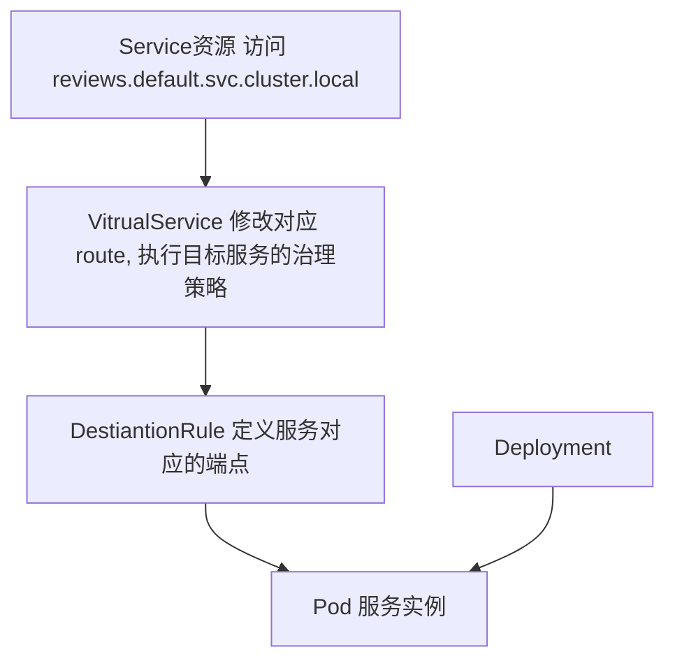
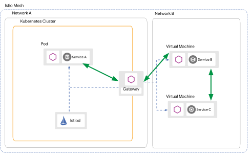
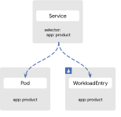
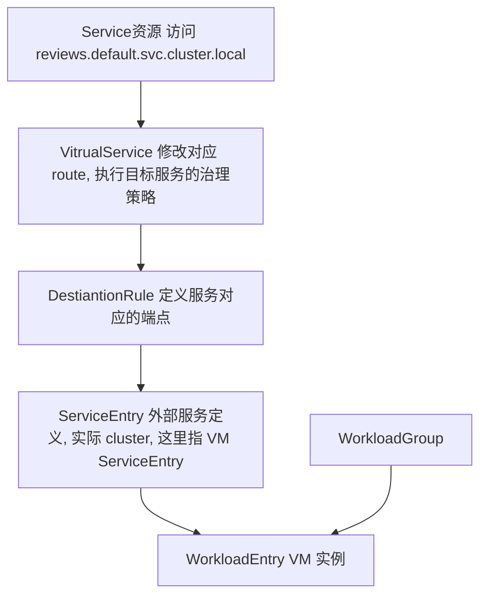

- [ServiceMesh 之 Isito](#servicemesh-之-isito)
  - [基础概念](#基础概念)
    - [为什么需要 ServiceMesh](#为什么需要-servicemesh)
    - [Istio](#istio)
    - [核心作用](#核心作用)
    - [核心优势](#核心优势)
      - [合适的业务场景](#合适的业务场景)
  - [Istio 使用](#istio-使用)
    - [流量治理原理](#流量治理原理)
      - [istio 的 VirtualService 与 DestinationRule 都分别做了什么](#istio-的-virtualservice-与-destinationrule-都分别做了什么)
        - [Destinationrule](#destinationrule)
        - [VirtualService](#virtualservice)
        - [总结](#总结)
      - [具体流量治理功能](#具体流量治理功能)
    - [虚机接入概念与使用](#虚机接入概念与使用)
      - [网络模式](#网络模式)
      - [虚机机制](#虚机机制)
        - [vm proxy](#vm-proxy)
        - [**工作负载层面**](#工作负载层面)
        - [服务层面](#服务层面)
        - [资源关系](#资源关系)
    - [可观测性概念与使用](#可观测性概念与使用)
    - [安全](#安全)
  - [Istio 深入排错](#istio-深入排错)
    - [Istio 组件](#istio-组件)
    - [Istio 安装方式与配置](#istio-安装方式与配置)
    - [Istio 工具 istioctl](#istio-工具-istioctl)
      - [安装](#安装)
      - [查看配置状态和详情](#查看配置状态和详情)
        - [proxy-status 提供 sidecar 的 pod 配置同步状态](#proxy-status-提供-sidecar-的-pod-配置同步状态)
        - [proxy-config 命令检查配置详情](#proxy-config-命令检查配置详情)
    - [Istio Sidecar Debug](#istio-sidecar-debug)
      - [开启 Debug 模式](#开启-debug-模式)
      - [查看具体实例的 xds 配置](#查看具体实例的-xds-配置)

# ServiceMesh 之 Isito

Service Mesh 是一个基础设施层，其独立运行在应用服务之外，提供应用服务之间安全、可靠、高效的通信，并为服务通信实现了微服务运行所需的基本组件功能，包括服务注册发现、负载均衡、故障恢复、监控、权限控制等等。

总体架构图如图：


其中绿色方块为应用服务，蓝色方块为 Sidecar，应用服务之间通过 Sidecar 进行通信，整个服务通信形成图中的蓝色网络连线，图中所有蓝色部分就形成了 Service Mesh。

## 基础概念

### 为什么需要 ServiceMesh

最主要的理由来自于 Service Mesh 在提供微服务框架功能的同时，它是一个独立运行在应用服务之外的模块。这带来的好处就是应用服务不再需要为接入微服务框架而在代码和配置中添加繁多的依赖库和依赖配置项，实现了微服务框架和应用服务之间的解耦，让应用服务代码更加纯粹地去实现自己的业务逻辑，能够更加轻松地接入微服务框架，享受微服务框架带来的各种服务治理功能。

### Istio

[Isito 官网文档](https://istio.io/latest/docs/)
Istio 作为 Servcie Mesh 的一种实现，由 Google、IBM、Lyft Envoy 联手开发，一开始就定位于实现 Service Mesh 模式的微服务框架。

Istio 在架构上可以分成两个层面：

- 数据区（data plane）：由通信代理组件（Envoy/Linkerd 等）和组件之间的网络通信组成。
- 控制区（control plane）：负责对通信代理组件进行管理和配置。


详细可参考：[istio 架构官网文档](https://istio.io/latest/docs/ops/deployment/architecture/)

### 核心作用

- 流量治理
- 可观测性
- 安全

### 核心优势

- 多集群 与 多云
- 多架构
- 多网络
- 多协议

#### 合适的业务场景

- 多架构多语言业务
  - 统一的服务治理
  - 服务之间的可观测性
  - 统一的安全
  - 云原生服务与传统服务（虚机，无法上云的服务）的双驱动运行
- 业务服务与基础设施的解耦
  - 减少基础设施对业务服务逻辑的入侵
  - 解耦服务与服务之间安全、治理之间业务员逻辑
- 管理成本和开发难度降低，升级困难
  - 基础设施，微服务架构难以升级

## Istio 使用

### 流量治理原理

#### istio 的 VirtualService 与 DestinationRule 都分别做了什么

我们都知道 istio 的`VirtualService`和`DestinationRule`，是用来进行流量控制的，但是`istio`用它们具体做什么事情呢？对`envoy`产生了那些影响呢？今天我们就以 bookinfo 的 reviews 服务探究一下。

首先要先部署好`kubernetes`与`istio`，并提前安装好`bookinfo`这个联系项目，按照官方步骤就行了。

##### Destinationrule

先看下默认的`envoy` `cluster`信息

```armasm
$ istioctl pc cluster productpage-v1-7f44c4d57c-nwncm

reviews.default.svc.cluster.local                            9080      -              outbound      EDS
```

再看下`reviews.default.svc.cluster.local` 的 `endpoint`

```cpp
$ istioctl pc endpoint productpage-v1-7f44c4d57c-nwncm --cluster "outbound|9080||reviews.default.svc.cluster.local"

ENDPOINT             STATUS      OUTLIER CHECK     CLUSTER
172.17.0.13:9080     HEALTHY     OK                outbound|9080||reviews.default.svc.cluster.local
172.17.0.14:9080     HEALTHY     OK                outbound|9080||reviews.default.svc.cluster.local
172.17.0.15:9080     HEALTHY     OK                outbound|9080||reviews.default.svc.cluster.local
```

可以看到`reviews.default.svc.cluster.local` cluster 后面挂着三个 endpoint，与预期一致

接下来添加 reviews 的 DestinationRule

```yaml
$ cat destination-rule-reviews.yaml
apiVersion: networking.istio.io/v1alpha3
kind: DestinationRule
metadata:
  name: reviews
spec:
  host: reviews
  trafficPolicy:
    loadBalancer:
      simple: RANDOM
  subsets:
  - name: v1
    labels:
      version: v1
  - name: v2
    labels:
      version: v2
  - name: v3
    labels:
      version: v3

$ kubectl apply -f destination-rule-reviews.yaml
```

再看下`cluster` 的情况

```delphi
reviews.default.svc.cluster.local                            9080      -              outbound      EDS
reviews.default.svc.cluster.local                            9080      v1             outbound      EDS
reviews.default.svc.cluster.local                            9080      v2             outbound      EDS
reviews.default.svc.cluster.local                            9080      v3             outbound      EDS
```

发现在原有的 cluster 基础上新添加了三个 cluster，分别是 v1,v2,v3 版本
再看下 endpoint

```cpp
172.17.0.13:9080                HEALTHY     OK                outbound|9080|v2|reviews.default.svc.cluster.local
172.17.0.13:9080                HEALTHY     OK                outbound|9080||reviews.default.svc.cluster.local
172.17.0.14:9080                HEALTHY     OK                outbound|9080|v1|reviews.default.svc.cluster.local
172.17.0.14:9080                HEALTHY     OK                outbound|9080||reviews.default.svc.cluster.local
172.17.0.15:9080                HEALTHY     OK                outbound|9080|v3|reviews.default.svc.cluster.local
172.17.0.15:9080                HEALTHY     OK                outbound|9080||reviews.default.svc.cluster.local
```

发现不同的 `cluster` 也出现了对应的 `endpoint` 。
现在可以知道 `DestinationRule` 是用来改写 `cluster` 的，不同的 `cluster` 有相应的 `endpoint`，这样方便 `route`。

##### VirtualService

先查看 9080 的`route`信息

```armasm
$ istioctl pc route productpage-v1-7f44c4d57c-nwncm --name 9080 -o json
...
{
                "name": "reviews.default.svc.cluster.local:9080",
                "domains": [
                    "reviews.default.svc.cluster.local",
                    "reviews.default.svc.cluster.local:9080",
                    "reviews",
                    "reviews:9080",
                    "reviews.default.svc.cluster",
                    "reviews.default.svc.cluster:9080",
                    "reviews.default.svc",
                    "reviews.default.svc:9080",
                    "reviews.default",
                    "reviews.default:9080",
                    "10.100.34.243",
                    "10.100.34.243:9080"
                ],
                "routes": [
                    {
                        "name": "default",
                        "match": {
                            "prefix": "/"
                        },
                        "route": {
                            "cluster": "outbound|9080||reviews.default.svc.cluster.local",
                            "timeout": "0s",
                            "retryPolicy": {
                                "retryOn": "connect-failure,refused-stream,unavailable,cancelled,resource-exhausted,retriable-status-codes",
                                "numRetries": 2,
                                "retryHostPredicate": [
                                    {
                                        "name": "envoy.retry_host_predicates.previous_hosts"
                                    }
                                ],
                                "hostSelectionRetryMaxAttempts": "5",
                                "retriableStatusCodes": [
                                    503
                                ]
                            },
                            "maxGrpcTimeout": "0s"
                        },
                        "decorator": {
                            "operation": "reviews.default.svc.cluster.local:9080/*"
                        }
                    }
                ]
            }

...
```

默认情况下，当访问 `reviews.default.svc.cluster.local` 服务时候，会将流量转发到 `outbound|9080||reviews.default.svc.cluster.local`。从上面可以知道这个 cluster 后面挂着三个不同版本的 endpoint，所以在访问的时候是轮训出现的。
下面设置 `virtualService`，只允许访问 `v1` 版本。

```yaml
$ cat virtual-service-reviews-v1.yaml
apiVersion: networking.istio.io/v1alpha3
kind: VirtualService
metadata:
  name: reviews
spec:
  hosts:
    - reviews
  http:
  - route:
    - destination:
        host: reviews
        subset: v1

$ kubectl apply -f virtual-service-reviews-v1.yaml
```

在看下 route 的情况

```json
"routes": [
                    {
                        "match": {
                            "prefix": "/"
                        },
                        "route": {
                            "cluster": "outbound|9080|v1|reviews.default.svc.cluster.local",
                            "timeout": "0s",
                            "retryPolicy": {
                                "retryOn": "connect-failure,refused-stream,unavailable,cancelled,resource-exhausted,retriable-status-codes",
                                "numRetries": 2,
                                "retryHostPredicate": [
                                    {
                                        "name": "envoy.retry_host_predicates.previous_hosts"
                                    }
                                ],
                                "hostSelectionRetryMaxAttempts": "5",
                                "retriableStatusCodes": [
                                    503
                                ]
                            },
                            "maxGrpcTimeout": "0s"
                        },
                        "metadata": {
                            "filterMetadata": {
                                "istio": {
                                    "config": "/apis/networking.istio.io/v1alpha3/namespaces/default/virtual-service/reviews"
                                }
                            }
                        },
                        "decorator": {
                            "operation": "reviews.default.svc.cluster.local:9080/*"
                        }
                    }
                ]
            }
```

发现流量只会转发到 reviews 的 v1 版本，v1 版本的 cluster 只会有 v1 的 endpoint，所以现在只能访问 v1 版本的 reviews。
再设置权重访问 v2,v3 版本。

```yaml
apiVersion: networking.istio.io/v1alpha3
kind: VirtualService
metadata:
  name: reviews
spec:
  hosts:
    - reviews
  http:
    - route:
        - destination:
            host: reviews
            subset: v2
          weight: 50
        - destination:
            host: reviews
            subset: v3
          weight: 50
```

再看下 route 信息

```json
"routes": [
                    {
                        "match": {
                            "prefix": "/"
                        },
                        "route": {
                            "weightedClusters": {
                                "clusters": [
                                    {
                                        "name": "outbound|9080|v2|reviews.default.svc.cluster.local",
                                        "weight": 50
                                    },
                                    {
                                        "name": "outbound|9080|v3|reviews.default.svc.cluster.local",
                                        "weight": 50
                                    }
                                ]
                            },
```

可以发现`envoy`会根据权重讲流量转发到 v2,v3 版本。

##### 总结

至此我们清楚了，`VirtualService`是用来修改 `route` 规则的，这样就可以将流量转发到不同的 `cluster`。而 `DestinationRule` 会创建不同的 `cluster` 供`route`使用。

让我们看一下流程图



#### 具体流量治理功能

- 流量治理
- 灰度发布
- 网关能力
  - 增加了 GateWay 资源

### 虚机接入概念与使用

[Istio 虚机架构](https://istio.io/latest/docs/ops/deployment/vm-architecture/)

#### 网络模式

由于虚机处于网格之外，存在网络通讯差异，可以总结为两种模式：

- 单网络模式，虚机可以与 网格内的 Pod 直接网络通讯


- 多网络模式， 虚机不能与网格内的 Pod 直接通讯，需要通过东西网关进行通讯



#### 虚机机制

##### vm proxy

虚机上运行的 proxy 是用 Go 编写的 Istio sidecar 代理。
Sidecar 上的 Istio agent 将代理应用程序的请求，可以实现虚拟机到服务网格的无缝多集群访问。

##### **工作负载层面**

Isito 提供了两种资源来实现虚机的工作负载，使之能够以一种原生的姿态运行在 Kubernetes 集群中。

- `WorkloadGroup` 代表一组逻辑上拥有公共属性（元数据、身份、端口、探针）的工作负载，类似 Kubernetes 的 Deployment。
- `WorkloadEntry` 代表一个虚机的实例，类似 Kubernetes 的 Pod。

##### 服务层面

为了让使用者可靠地调用工作负载，安装 Kubernetes 的运行模式，需要声明一个 Service 关联。（这允许客户端到达一个稳定的主机名，比如 product.default.svc.cluster.local，而不是一个临时的 IP 地址。这也允许您通过 DestinationRule 和 VirtualService api 在 Istio 中使用高级路由功能）。

从实际运行状态，我们可以看出 `Service` 与 `WorkloadEntry` 的关系


为了发挥 Isito 的功能，我们来分析一下治理层面资源的关系
例如当 访问 vm-svc.default.svc.cluster.local 服务时，会将之解析到对应的服务，到达服务之前，

##### 资源关系

与 k8s 资源的对应关系
对比项 | K8s | VM
----|-----|---
基本调度单位 | Pod | WorkloadEntry
编排 | Deployment | WorkloadGroup
服务注册与发现 | Service | Service + ServiceEntry（istio 内部维护的服务注册条目）



### 可观测性概念与使用

在数据面的 Sidecar，网格天生能够感知服务间的流量，只要将其流量捕获并且记录。

### 安全

Istiod 作为 CA 颁发机构，能够在网格能进行 mTLS 加密通讯。

## Istio 深入排错

### Istio 组件

- Iistid
  - pilot
  - 功能: 服务发现、证书统一、策略下发
- istio-gateway
  - ingressgateway 南北向流量
  - eastwestgateway 东西向流量
- istio-proxy
  - proxyv2 (Sidecar)

### Istio 安装方式与配置

- 手动部署或者 Helm
- IstioOperator 方式部署
  - IstioOperator CRD 定义着网格的所有配置和启用的组件

### Istio 工具 istioctl

#### 安装

```bash
$ curl -sL https://istio.io/downloadIstioctl | sh -
```

安装完成之后，直接执行 istioctl 即可看到所有支持子命令的相关介绍如下：

```bash
$ istioctl
Istio configuration command line utility for service operators to
debug and diagnose their Istio mesh.

Usage:
  istioctl [command]

Available Commands:
  analyze         Analyze Istio configuration and print validation messages
  authn           Interact with Istio authentication policies
  authz           (authz is experimental. Use `istioctl experimental authz`)
  convert-ingress Convert Ingress configuration into Istio VirtualService configuration
  dashboard       Access to Istio web UIs
  deregister      De-registers a service instance
  experimental    Experimental commands that may be modified or deprecated
  help            Help about any command
  kube-inject     Inject Envoy sidecar into Kubernetes pod resources
  manifest        Commands related to Istio manifests
  operator        Commands related to Istio operator controller.
  profile         Commands related to Istio configuration profiles
  proxy-config    Retrieve information about proxy configuration from Envoy [kube only]
  proxy-status    Retrieves the synchronization status of each Envoy in the mesh [kube only]
  register        Registers a service instance (e.g. VM) joining the mesh
  upgrade         Upgrade Istio control plane in-place
  validate        Validate Istio policy and rules (NOTE: validate is deprecated and will be removed in 1.6. Use 'istioctl analyze' to validate configuration.)
  verify-install  Verifies Istio Installation Status or performs pre-check for the cluster before Istio installation
  version         Prints out build version information
```

#### 查看配置状态和详情

前面章节中介绍了 istio 系统的核心是基于 envoy 来实现流量管理，其本质是通过控制面来生成和下发对应的配置给数据面，因此配置的下发在整个系统是非常重要的一环，这也是用户最为关心的内容，如果配置由于网络或者是控制面异常导致没有同步成功，数据面的流量控制将会产生一些不符合预期的问题。

##### proxy-status 提供 sidecar 的 pod 配置同步状态

- 为用户提供了获取网格集群内的所有被注入 sidecar 的 pod 配置同步状态

  ```bash
  [root@master-node-1 ~]# istioctl ps
  NAME                                                    CDS        LDS        EDS        RDS          ISTIOD                      VERSION
  daoweb-after-sales-5ff56846cd-f5c9m.test                SYNCED     SYNCED     SYNCED     SYNCED       istiod-6f7fbbb6d8-fpds9     1.9.9-dx-001
  daoweb-auth-54fd5566c8-bqxgb.test                       SYNCED     SYNCED     SYNCED     SYNCED       istiod-6f7fbbb6d8-fpds9     1.9.9-dx-001
  daoweb-coupons-6df85b8bff-xfcgm.test                    SYNCED     SYNCED     SYNCED     SYNCED       istiod-6f7fbbb6d8-fpds9     1.9.9-dx-001
  daoweb-extension-5748df89f7-bdqzd.test                  SYNCED     SYNCED     SYNCED     SYNCED       istiod-6f7fbbb6d8-fpds9     1.9.9-dx-001
  daoweb-mall-669dd48fc8-fvwrf.test                       SYNCED     SYNCED     SYNCED     SYNCED       istiod-6f7fbbb6d8-fpds9     1.9.9-dx-001
  daoweb-order-56bf566665-zptgw.test                      SYNCED     SYNCED     SYNCED     SYNCED       istiod-6f7fbbb6d8-fpds9     1.9.9-dx-001
  daoweb-recommend-6c5764666b-r5rz4.test                  SYNCED     SYNCED     SYNCED     SYNCED       istiod-6f7fbbb6d8-fpds9     1.9.9-dx-001
  daoweb-search-5bc49646d8-6j78b.test                     SYNCED     SYNCED     SYNCED     SYNCED       istiod-6f7fbbb6d8-fpds9     1.9.9-dx-001
  daoweb-ui-5bdbc98ff9-c6qvr.test                         SYNCED     SYNCED     SYNCED     SYNCED       istiod-6f7fbbb6d8-fpds9     1.9.9-dx-001
  daoweb-user-f7674b457-68kl4.test                        SYNCED     SYNCED     SYNCED     SYNCED       istiod-6f7fbbb6d8-fpds9     1.9.9-dx-001
  istio-eastwestgateway-59ff64dc97-4v8zl.istio-system     SYNCED     SYNCED     SYNCED     NOT SENT     istiod-6f7fbbb6d8-fpds9     1.9.9-dx-001
  istio-ingressgateway-647f9684fc-gcbbf.istio-system      SYNCED     SYNCED     SYNCED     SYNCED       istiod-6f7fbbb6d8-fpds9     1.9.9-dx-001
  ```

  从输出结果看，主要包含了两部分信息，分别是 xds 配置对应不同类型的同步状态，包含 CDS、LDS、EDS、RDS ，另外部分是 Pod 所连接的控制面信息，包括 istiod 对应的 Pod 名称和版本信息。

  [Envoy 官网](https://www.envoyproxy.io/docs/envoy/latest)
  针对 xds 的不同类型配置对应在 Pod 维度都有一个独立的同步状态，定义如下：

  - **SYNCED**：正常状态，表明最后一次配置同步操作已经从 istiod 下发到了 Envoy，并且收到了正确应答。

  - **NOT SENT**：表示 istiod 还没有发送任何配置给 Envoy，这往往是因为没有配置可以下发，例如上述示例列表中的 istio-egressgateway 这个 Pod，因为默认我们没有配置任何外部服务，所以 EDS 的配置是空的，对应的配置状态就是 NOT SENT。

  - **STALE**：异常状态，它表示 istiod 已经发送了一个配置更新请求给 Envoy，但是并没有收到任何的应答，这种情况往往是由于 Envoy 和 istiod 之间的网络原因或者是 istio 本身存在的 bug 导致的。

- 检查 Envoy 和 istiod 间的配置差异
  ```bash
  # 相同
  $ istioctl ps daoweb-after-sales-5ff56846cd-f5c9m.test
  Clusters Match
  Listeners Match
  Routes Match (RDS last loaded at Mon, 21 Mar 2022 12:41:21 CST)
  # 不同
  $ istioctl ps daoweb-after-sales-5ff56846cd-f5c9m.test
  Clusters Match
  --- Pilot Listeners
  +++ Envoy Listeners
  @@ -1,10 +1,11 @@
  {
      "dynamicListeners": [
        # 此处省略大量差异配置文本
      ]
  }
  Routes Don't Match (RDS last loaded at Mon, 21 Mar 2022 12:41:21 CST)
  --- Pilot Routes
  +++ Envoy Routes
  @@ -1,14 +1,31 @@
  {
      "dynamicRouteConfigs": [
        # 此处省略大量差异配置文本
      ]
  }
  ```

##### proxy-config 命令检查配置详情

在排查 istiod 和 envoy 之间的配置是否同步问题上为我们提供了帮助。但在实际的使用过程中，大部分问题往往并不是由于同步问题导致的，而是由于配置错误引发的，如果想要详细诊断 Istio 的配置详情，那就是 proxy-config。

- 查看指定 pod 的网格配置详情

  例如我们想要查看 productpage 这个服务对应的 `cluster` 配置信息，直接通过下述命令就可以获取：

  ```bash
  $ istioctl pc cluster productpage-v1-77d9f9fcdf-psv2z.default
  SERVICE FQDN                                                 PORT      SUBSET         DIRECTION     TYPE
  BlackHoleCluster                                             -         -              -             STATIC
  InboundPassthroughClusterIpv4                                -         -              -             ORIGINAL_DST
  PassthroughCluster                                           -         -              -             ORIGINAL_DST
  details.default.svc.cluster.local                            9080      -              outbound      EDS
  grafana.istio-system.svc.cluster.local                       3000      -              outbound      EDS
  httpbin.default.svc.cluster.local                            8000      -              outbound      EDS
  istio-egressgateway.istio-system.svc.cluster.local           80        -              outbound      EDS
  istio-egressgateway.istio-system.svc.cluster.local           443       -              outbound      EDS
  # 省略部分相似 cluster 信息
  ```

  上述命令中也可以替换成其它支持的类型来获取对应的 Envoy 配置，如果希望展示更加全面的信息，需要指定配置的输出类型为 json，如下所示：

  ```bash
  $ istioctl pc cluster productpage-v1-77d9f9fcdf-psv2z.default -o json
  [
      {
          "name": "BlackHoleCluster",
          "type": "STATIC",
          "connectTimeout": "1s",
          "filters": [
              {
                  "name": "envoy.filters.network.upstream.metadata_exchange",
                  "typedConfig": {
                      "@type": "type.googleapis.com/udpa.type.v1.TypedStruct",
                      "typeUrl": "type.googleapis.com/envoy.tcp.metadataexchange.config.MetadataExchange",
                      "value": {
                          "protocol": "istio-peer-exchange"
                      }
                  }
              }
          ]
      },
      {
          "name": "InboundPassthroughClusterIpv4",
          "type": "ORIGINAL_DST",
          "connectTimeout": "1s",
          "lbPolicy": "CLUSTER_PROVIDED",
          "circuitBreakers": {
              "thresholds": [
                  {
                      "maxConnections": 4294967295,
                      "maxPendingRequests": 4294967295,
                      "maxRequests": 4294967295,
                      "maxRetries": 4294967295
                  }
              ]
          },
      # 此处省去大量类似的配置
  ```

  json 格式输出的配置信息基本上是 Envoy 原生的配置格式定义，相比 short 类型的格式，json 里还能展示到更加细节的配置内容，比如上述结果里的连接超时配置、负载均衡策略、熔断参数配置等等。

- 通过过滤条件快速定位配置内容
  通过 json 格式输出的配置内容虽然很详细，但是仍然不利于我们诊断具体的问题，实际场景中我们往往只关注具体的某个服务端口或者是已经确定是 inbound 方向出了问题，这个时候我们可以通过再添加过滤的条件将配置的输出范围再缩小一些，根据命令介绍我们添加 `--port` 和 `--direction` 参数：

  ```bash
  $ istioctl pc cluster productpage-v1-77d9f9fcdf-psv2z.default --port 9080 --direction inbound -o json
  [
      {
          "name": "inbound|9080|http|productpage.default.svc.cluster.local",
          "type": "STATIC",
          "connectTimeout": "1s",
          "loadAssignment": {
              "clusterName": "inbound|9080|http|productpage.default.svc.cluster.local",
              "endpoints": [
                  {
                      "lbEndpoints": [
                          {
                              "endpoint": {
                                  "address": {
                                      "socketAddress": {
                                          "address": "127.0.0.1",
                                          "portValue": 9080
                                      }
                                  }
                              }
                          }
                      ]
                  }
              ]
          },
          "circuitBreakers": {
              "thresholds": [
                  {
                      "maxConnections": 4294967295,
                      "maxPendingRequests": 4294967295,
                      "maxRequests": 4294967295,
                      "maxRetries": 4294967295
                  }
              ]
          }
      }
  ]
  ```

  通过添加特定条件的对配置进行过滤，能够非常精确的输出我们想要的具体某块配置，方便我们进行问题的诊断和定位，比如检查下 endpoint 信息是否正确、服务治理配置是否存在问题等等。

### Istio Sidecar Debug

#### 开启 Debug 模式

- 全局 Debug
- 对具体 Pod 的 istio-proxy 开启 debug

#### 查看具体实例的 xds 配置

- istioctl pc
- 进入 sidecar 容器
- 暴露实例 xds 配置 api
- 通过 istioctl portforward 暴露 xds 配置接口

* ### 数据面异常排错
* 业务服务状态
* 资源配置
* 服务发现检测
* 策略 XDS 定位
